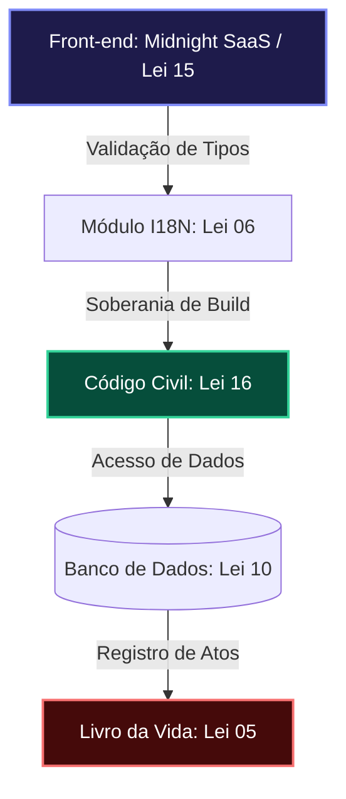

# 🏛️ Livro da Vida — Michel's Travel 1
### Protocolo de Governança e Registro Permanente (Lei 05)

> "O código que não é governado pelo rigor está destinado à entropia. A Engenharia Canônica é a nossa defesa contra o caos."

---

## 🛡️ DASHBOARD DE INTEGRIDADE CANÔNICA
| Pilar Normativo | Status | Nível de Conformidade | Evidência Técnica |
| :--- | :---: | :---: | :--- |
| **L01: Autoridade** | 🛡️ | **PLENO** | Livro da Vida Ativo |
| **L06: Robustez** | 🏗️ | **ELITE** | Tipagem Estrita & I18n |
| **L15: UX (WOW)** | 💎 | **PREMIUM** | Midnight Dashboard v2 |
| **L16: Infra (Civil)** | 🚢 | **OPERALIONAL** | Código Civil de Deploy |

---

## 📖 SEÇÃO APOLOGÉTICA: O Fundamento do Método
*Uma defesa da Engenharia Canônica contra a mediocridade técnica.*

Este projeto não é apenas uma aplicação de viagens; é um **testemunho de ordem**. A Seção Apologética justifica as nossas Leis como os únicos meios de garantir:

1. **Imutabilidade do Propósito:** As Leis impedem que o software se degrade em um "espaguete de código". Cada linha deve prestar contas ao Protocolo.
2. **Resiliência Transcendente:** O software deve sobreviver a mudanças de ambiente (Windows, Linux, Cloud) sem perder sua alma técnica. O **Código Civil de Deploy** é a nossa ferramenta de soberania infraestrutural.
3. **Beleza como Obrigação:** Diferente de MVPs simplórios, aqui a estética (Lei 15) é tratada com o mesmo rigor que a segurança do banco de dados. Um software feio é um software desrespeitoso com o usuário.

---

## 🗺️ DIAGRAMA DE ARQUITETURA CANÔNICA (Oversight MIA)

---

## 📜 REGISTRO DE EVENTOS (CRONOLOGIA)

### [2026-04-16] — Saneamento de Infraestrutura & Promulgação da Lei 16
**Autor:** Antigravity AI & Engenharia Michel's Travel
**Fundamento:** Código Civil de Deploy
- **Correção de "Paridade de Build":** Movimentação de ferramentas de build para `dependencies`.
- **Compatibilidade Universal:** Refatoração de caminhos dinâmicos no `vite.config.ts`.
- **Sincronização i18n:** Alinhamento total de chaves (PT, EN, ES).

### [2026-04-15] — Upgrade de Infraestrutura i18n
**Autor:** Antigravity AI
- **Type Safety:** Chaves de tradução validadas em tempo de compilação.
- **Performance:** Memoização de funções via `useCallback`.

### [2026-04-13] — Evento Crítico: Restauração Canônica de SearchResults.tsx
- **Reset Estrutural:** Saneamento de duplicações e erros de escopo.
- **Saneamento de Contraste:** Legibilidade absoluta (Lei 15).

---

## 🏗️ APÊNDICE: Código Civil de Deploy (Normas de Conduta)
1. **Soberania de Runtime:** Build deve ser universal (Windows/Linux).
2. **Resiliência do Front:** Uso de `import.meta.env` para conformidade com o bundler.
3. **Escaneamento de Chaves:** Sincronização obrigatória de idiomas.
4. **Vermin de Dependências:** `tsx`, `vite` e `typescript` não podem ser meros dev-deps em ambientes de nuvem.
