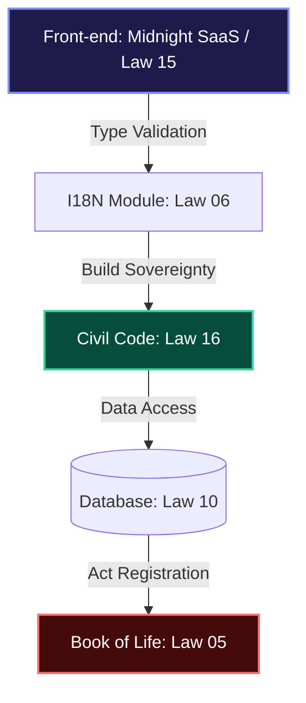

# 🏛️ Book of Life — Michel's Travel 1
### Permanent System Event Log (Law 05)

> "Code that is not governed by rigor is destined for entropy. Canonical Engineering is our defense against chaos."

---

## 🛡️ CANONICAL INTEGRITY DASHBOARD
| Normative Pillar | Status | Compliance Level | Technical Evidence |
| :--- | :---: | :---: | :--- |
| **L01: Authority** | 🛡️ | **FULL** | Book of Life Active |
| **L06: Robustness** | 🏗️ | **ELITE** | Strict Typing & I18n |
| **L15: UX (WOW Factor)** | 💎 | **PREMIUM** | Midnight Dashboard v2 |
| **L16: Infra (Civil Code)** | 🚢 | **OPERATIONAL** | Deployment Civil Code |

---

## 📖 APOLOGETIC SECTION: The Foundation of the Method
*A defense of Canonical Engineering against technical mediocrity.*

This project is not merely a travel application; it is a **testimony of order**. The Apologetic Section justifies our Laws as the only means to ensure:

1. **Immutability of Purpose:** Our Laws prevent software from degrading into "spaghetti code." Every line must be accountable to the Protocol.
2. **Transcendent Resilience:** Software must survive environmental changes (Windows, Linux, Cloud) without losing its technical soul. The **Deployment Civil Code** is our tool for infrastructural sovereignty.
3. **Beauty as an Obligation:** Unlike simplistic MVPs, here aesthetics (Law 15) are treated with the same rigor as database security. Ugly software is disrespectful to the user.

---

## 🗺️ CANONICAL ARCHITECTURE DIAGRAM (MIA Oversight)

---

## 📜 EVENT LOG (CHRONOLOGY)

### [2026-04-16] — Infrastructure Crisis Resolution (Post-Mortem)
**Author:** Antigravity AI & Michel's Travel Engineering
**Status:** RESOLVED
**Foundation:** Law 16 (Infrastructure Civil Code)

#### 📝 Root Cause Analysis
Successive deployment failures on Render were triggered by a "Dependency Gap." The project migrated to a TypeScript-based build script (`build.ts`) that required several tools (`tsx`, `esbuild`, `vite`, `cross-env`) to be available during the production build phase. However, these were initially categorized as `devDependencies`, which are ignored by cloud providers in production mode.

#### 🛠️ Resolution & Hardening
- **Consolidated Dependencies:** Moved all architectural build tools to the core `dependencies` list.
- **Cross-Platform Pathing:** Eliminated `import.meta.dirname` in favor of `fileURLToPath` to ensure Linux compatibility.
- **Vite/Process Safeguard:** Refactored client-side environment checks to use `import.meta.env`, preventing `ReferenceError` during bundling.
- **Linguistic Alignment:** Synchronized PT, EN, and ES translations to ensure UI stability across all regions.

### [2026-04-15] — I18n Infrastructure Upgrade
**Author:** Antigravity AI
- **Type Safety:** Translation keys validated at compile-time.
- **Performance:** Function memoization via `useCallback`.

### [2026-04-13] — Critical Event: Canonical Restoration of SearchResults.tsx
- **Structural Reset:** Sanitation of duplications and scope errors.
- **Contrast Sanitation:** Absolute legibility (Law 15).

---

## 🏗️ APPENDIX: Deployment Civil Code (Conduct Norms)
1. **Runtime Sovereignty:** Build must be universal (Windows/Linux).
2. **Front-end Resilience:** Use of `import.meta.env` for bundler compliance.
3. **Key Scanning:** Mandatory synchronization across all supported languages.
4. **Dependency Integrity:** `tsx`, `vite`, and `typescript` are core build-time requirements and must reside in production dependencies for cloud environments.
