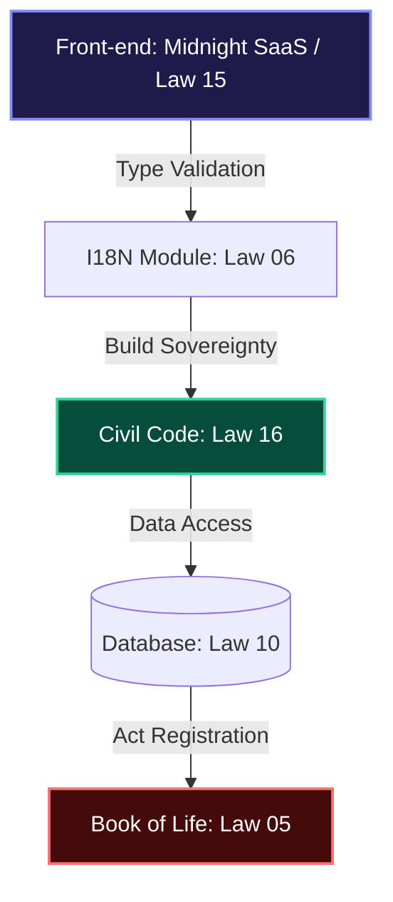

# 🏛️ Book of Life — Michel's Travel 1
### Permanent System Event Log (Law 05)

> "Code that is not governed by rigor is destined for entropy. Canonical Engineering is our defense against chaos."

---

## 🛡️ CANONICAL INTEGRITY DASHBOARD
| Normative Pillar | Status | Compliance Level | Technical Evidence |
| :--- | :---: | :---: | :--- |
| **L01: Authority** | 🛡️ | **FULL** | Book of Life Active |
| **L06: Robustness** | 🏗️ | **ELITE** | Strict Typing & I18n |
| **L15: UX (WOW Factor)** | 💎 | **PREMIUM** | Midnight Dashboard v2 |
| **L16: Infra (Civil Code)** | 🚢 | **OPERATIONAL** | Deployment Civil Code |

---

## 📖 APOLOGETIC SECTION: The Foundation of the Method
*A defense of Canonical Engineering against technical mediocrity.*

This project is not merely a travel application; it is a **testimony of order**. The Apologetic Section justifies our Laws as the only means to ensure:

1. **Immutability of Purpose:** Our Laws prevent software from degrading into "spaghetti code." Every line must be accountable to the Protocol.
2. **Transcendent Resilience:** Software must survive environmental changes (Windows, Linux, Cloud) without losing its technical soul. The **Deployment Civil Code** is our tool for infrastructural sovereignty.
3. **Beauty as an Obligation:** Unlike simplistic MVPs, here aesthetics (Law 15) are treated with the same rigor as database security. Ugly software is disrespectful to the user.

---

## 🗺️ CANONICAL ARCHITECTURE DIAGRAM (MIA Oversight)

---

## 📜 EVENT LOG (CHRONOLOGY)

### [2026-04-16] — Infrastructure Crisis Resolution (Post-Mortem)
**Author:** Antigravity AI & Michel's Travel Engineering
**Status:** IN PROGRESS / HARDENING
**Foundation:** Law 16 (Infrastructure Civil Code)

#### 📝 Root Cause Analysis
Successive deployment failures on Render were triggered by a "Dependency Gap" and potential Resource Exhaustion (OOM). The project's build script required tools that were missing in production and hit memory limits of the cloud environment.

#### 🛠️ Corrective Actions & Hardening
- **Consolidated Dependencies:** Moved `tsx`, `esbuild`, `vite`, and `cross-env` to the core `dependencies` list.
- **Fault-Tolerant Asset Sync**: Refactored `script/build.ts` to gracefully skip mobile metadata sync if `mobile-client` source or manifest files are missing, preventing total build failure.
- **Orchestration Sovereignty (Docker Mode)**: Discovered that `render.yaml` was bypassing the `Dockerfile` by using the default Node runtime. Shifted orchestration to `env: docker` to enforce our optimized build environment.
- **Architectural Shift (Node 20 Full)**: Migrated to the full `node:20` image (Debian) to ensure 100% availability of system libraries (`glibc`/`musl` parity).
- **Memory Optimization**: Increased Node heap limit to 4096MB and standardized execution via `ENV NODE_OPTIONS` to prevent silent OOM crashes.
- **Diagnostic Instrumentation**: Added `[BUILD]` step logging and fault-tolerant manifest syncing to identify the exact point of failure.
- **Cross-Platform Pathing:** Eliminated `import.meta.dirname` in favor of `fileURLToPath` for Linux compatibility.
- **Protocol Enactment:** Formally established the **Deployment Civil Code** as a safeguard against future architectural regression.

### [2026-04-15] — I18n Infrastructure Upgrade
**Author:** Antigravity AI
- **Type Safety:** Translation keys validated at compile-time.
- **Performance:** Function memoization via `useCallback`.

---

## 🏗️ APPENDIX: Deployment Civil Code (Conduct Norms)
1. **Runtime Sovereignty:** Build must be universal (Windows/Linux).
2. **Front-end Resilience:** Use of `import.meta.env` for bundler compliance.
3. **Internal Oversight:** All build scripts must include diagnostic logging and memory management.
4. **Dependency Integrity:** `tsx`, `vite`, and `typescript` are core build-time requirements and must reside in production dependencies for cloud environments.

## [2026-04-19] Harvard Project Governance Update
O projeto foi reorganizado seguindo a estrutura de gestão de Harvard, focada em rigor acadêmico e fases bem definidas:
- **Phase I: Research** - Auditoria de UI e arquitetura base.
- **Phase II: Development** - Implementação do Scanner e Mobile Client.
- **Phase III: Peer Review** - Auditoria de segurança e revisão de código.
- **Phase IV: Publication** - Lançamento e monitoramento.

Acompanhe o progresso através dos Milestones e Issues categorizadas.
